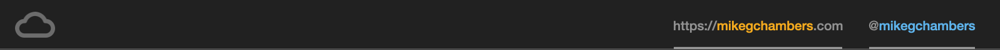

# Workshop, Lab and Demo Code for the AWS Machine Learning Specialty Certification Course

Hello!  Mike here...

> NOTE: Please be aware that some of the code presented in these lessons has been updated since the recordings were made. While you might notice minor discrepancies, they should not affect the overall understanding. Any significant changes or updates have been clearly highlighted in the accompanying notebooks for your convenience.

This repository has been created for my AWS MLS-C01 course.  Take a look at it here: https://learn.mikegchambers.com/p/aws-machine-learning-specialty-certification-course

Feel free to clone this repository and play with the code.  The course steps through all the principles used in the code and has recorded video walkthroughs that explain it in depth.

Thanks for checking out this repo.  Hope to see you inside the course!

:)